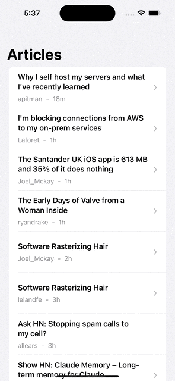

# HNTestMobile

HNTestMobile is an iOS application that displays recent articles about mobile development from Hacker News. This project is built using Swift and SwiftUI, implementing MVVM architecture, Combine for data binding, and Core Data for local persistence.

# Snapshots

</img>
</img>

## Features

- Fetches and displays recent posts about mobile development from the Hacker News API
- Pull-to-refresh mechanism to update content
- Offline access to previously fetched articles
- In-app web view for reading full articles
- Swipe-to-delete functionality for individual posts
- Persistent deletion of posts across app restarts and data refreshes

## Technologies Used

- Swift 5
- SwiftUI
- Combine
- Core Data
- MVVM Architecture

## Requirements

- iOS 15.0+
- Xcode 13.0+

## Installation

1. Clone this repository:
   ```
   git clone https://github.com/yourusername/MobileHackerNews.git
   ```
2. Open `HNTestMobile.xcodeproj` in Xcode.
3. Build and run the project on your simulator or device.

## Running the Project

1. Open the project in Xcode.
2. Select your target device or simulator.
3. Click the "Run" button or press `Cmd + R`.

**Note:** If you encounter a model error when trying to run the project, follow these steps:

1. In Xcode, delete the `HNTestMobile.xcdatamodeld` file.
2. In Finder, locate the project directory.
3. Drag the `HNTestMobile.xcdatamodeld` file from Finder back into your Xcode project.
4. Ensure "Copy items if needed" is checked and click "Finish".
5. Try running the project again.
